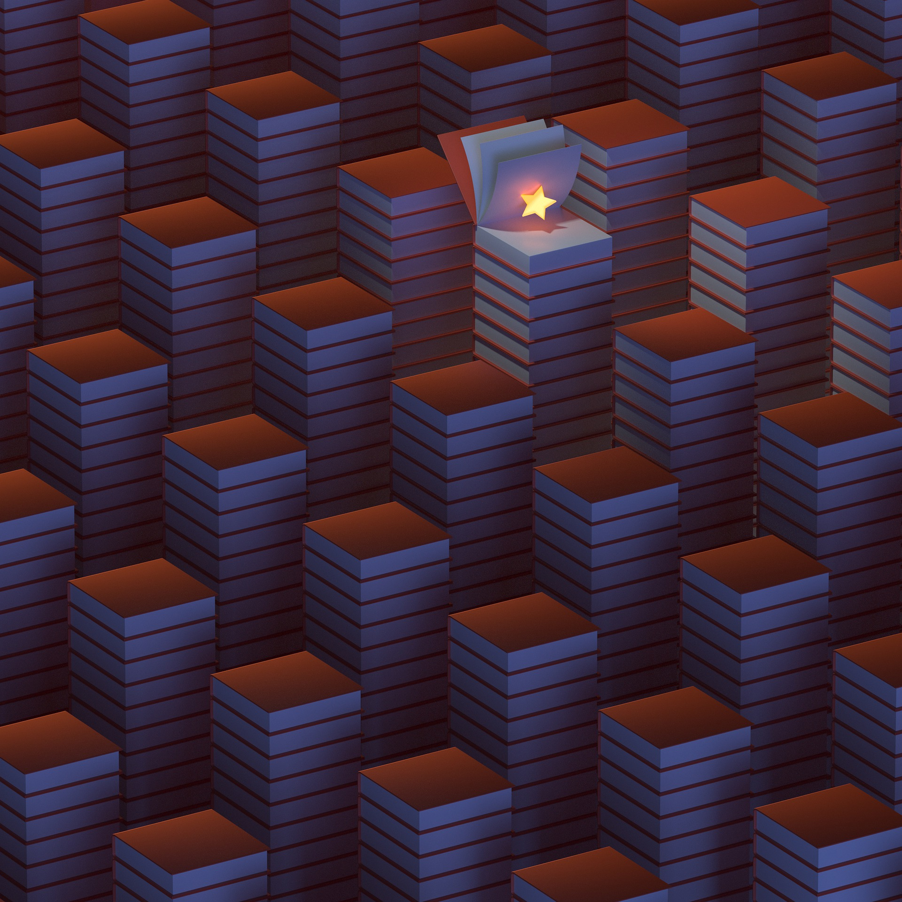

[home](index.md) | [Beschreibung des Panels](beschreibung.md)

## Willkommen zum Panel „Weder Fail noch Lobgesang: Nicht-eindeutige Wertung von Literatur im Digitalen Raum“, Montag 26.09.22, 1400–1600 Uhr
[27. Deutscher Germanistentag 2022](https://express.converia.de/frontend/index.php?folder_id=4175&page_id=) | 25.–28. September 2022 | Universität Paderborn im [Themenbereich 2: Phänomenorientierte Zugänge](https://express.converia.de/frontend/index.php?page_id=23733).

### Organisatorinnen
- Prof. Dr. Berenike Herrmann (Bielefeld)
- Dr. Maria Kraxenberger (Stuttgart)

### Abstracts

- [Abstract Thomas Ernst](abstract_ernst.md)
- [Abstract Anna Moskvina und Kirstina Petzold](abstract_moskvina_petzold.md)
- [Abstract Sandra Richter und Georg Pardi](abstract_richter_pardi.md)
- [Abstract Simone Winko](abstract_winko.md)

### Details
- Montag 26.09.22, 14:00–16:00 Uhr
- Themenbereich 2: Phänomenorientierte Zugänge 
- Panel 2.53 
- Raum C5.206

### vorläufiger Ablauf

Prof. Dr. Berenike Herrmann (Bielefeld), Dr. Maria Kraxenberger (Stuttgart): Einführung:
Nicht-eindeutige Wertung von Literatur im Digitalen Raum

Anna Moskvina (Hildesheim), Kristina Petzold (Bielefeld): „Einfach klasse!“ – Eine kor-
puslinguistische Analyse zur Eindeutigkeit von digitalen rezensiven Texten auf Ama-
zon.de und Buechertreff.de

Prof. Dr. Sandra Richter (Marbach, Stuttgart) und Dr. Georg Pardi (IWM): Nicht-eindeutiges Erleben und Bewerten von kanonischer Literatur im Digitalen Raum

Prof. Dr. Simone Winko (Göttingen): Ausgewogen, anschlussfähig, unentschieden? Zum
Begriff der nicht-eindeutigen Wertung und zur Vielfalt uneindeutiger Wertungen in
der digitalen Kommunikation über Literatur

Prof. Dr. Thomas Ernst (Antwerpen): Memes und Mojo: Mehrwerte für die Online-
Literaturkritik? Zur Messbarkeit uneindeutiger Wertungen in Sozialen Medien

